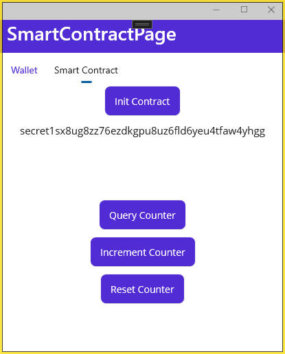

# Building Cross-Platform Apps with Secret.NET

In this article you will learn how to build a native cross-platform mobile app with Secret.NET and .NET MAUI.

By the end of this article, you will have a mobile app that can run on Android, iOS, and even on a Windows or MacOS desktop PC.

**You will learn how to:**

- create a cross-platform mobile app with .NET MAUI
- setup a Secret.NET client and connect to Secret Network
- create an integrated wallet
- fund the wallet via Secret's testnet faucet
- query the balance of a wallet
- initialize a secret contract
- interact with and query a secret contract

## Table of Contents

- [Building Cross-Platform Apps with Secret.NET](#building-cross-platform-apps-with-secretnet)
  - [Table of Contents](#table-of-contents)
  - [Current options for building a secret mobile application](#current-options-for-building-a-secret-mobile-application)
    - [JavaScript](#javascript)
    - [.NET / C#](#net--c)
      - [Secret.NET](#secretnet)
        - [Additional packages](#additional-packages)
      - [What is .NET MAUI?](#what-is-net-maui)
        - [Who .NET MAUI is for](#who-net-maui-is-for)
        - [More information about .NET MAUI:](#more-information-about-net-maui)
  - [Getting started](#getting-started)
    - [Prerequisites](#prerequisites)
    - [Create a .NET MAUI project and app](#create-a-net-maui-project-and-app)
    - [Install Secret.NET and other useful nuget packages](#install-secretnet-and-other-useful-nuget-packages)
    - [Build the application](#build-the-application)
      - [Setup the Secret.NET client](#setup-the-secretnet-client)
      - [Create the UI](#create-the-ui)
        - [Wallet Page UI](#wallet-page-ui)
        - [Smart Contract Page UI](#smart-contract-page-ui)
      - [Add functionality](#add-functionality)
        - [Wallet Page](#wallet-page)
          - [Create a Wallet](#create-a-wallet)
        - [Smart Contract Page](#smart-contract-page)
          - [Initialize a new smart contract instance](#initialize-a-new-smart-contract-instance)
          - [Query and execute methods on a smart contract](#query-and-execute-methods-on-a-smart-contract)
      - [Run the app in the android simulator](#run-the-app-in-the-android-simulator)
  - [Congratulations](#congratulations)
  - [Additional resources](#additional-resources)

## Current options for building a secret mobile application

If you want to write an cross-platform mobile application that works with Secret Network you have the choice of using **JavaScript** or **.NET / C#** (which is the focus of this article).

### JavaScript

If you'd like to use JavaScript, you can use one of the many JavaScript based Frameworks for mobile development like [NativeScript](https://nativescript.org/), [React Native](https://reactnative.dev/) or [Ionic](https://ionicframework.com/). You can then use [secretjs](https://github.com/scrtlabs/secret.js), the official JavaScript Library for Secret Network. In addition there is also [Griptape](https://docs.griptapejs.com/), a web framework for developing dApps on Secret Network that can simplify your workload.

One of the disadvantages of the JavaScript approach is that the user can only use the mobile application through an extra wallet application, such as [StarShell](https://starshell.net/) or [Fina](https://fina.cash/). An advantage; however, would be that often large parts of an existing web application can be reused.

### .NET / C#

By using [Secret.NET](https://github.com/0xxCodemonkey/SecretNET) ([nuget](https://www.nuget.org/packages/SecretNET)) a community .NET Library for Secret Network, .NET / C# is another way to build a true native cross-platform mobile app for Android and iOS

One advantage here, in contrast to the JavaScript solution, is that Secret.NET has an integrated wallet and thus runs independently without an external wallet application, thus enhancing the user experience. For the storage of the private key, the most secure method is used for each platform, e.g. the KeyChain under iOS.

#### Secret.NET

[Secret.NET](https://github.com/0xxCodemonkey/SecretNET) is a .NET Library for interacting with Secret Network. The library is written in .NET 6 and supports MAUI.

Secret.NET is a full port of [secretjs](https://github.com/scrtlabs/secret.js). It supports every possible message and transaction type and handles input/output & encryption/decryption for Secret Contracts.


**TODO: more details about Secret.NET, Links to docs & snippets, Examples, etc.**
**TODO: general infos about Queries and Transactions, Overview of the SECRET.NET API structure **

##### Additional packages

In addition the following complementary packages are available, which act as a layer on top of the Secret.NET:

- [**SecretNET.Token**](https://github.com/0xxCodemonkey/SecretNET.Token) supports all methods of the [reference implementation](https://github.com/scrtlabs/snip20-reference-impl) for the [**SNIP20 contract**](https://docs.scrt.network/secret-network-documentation/development/snips/snip-20-spec-private-fungible-tokens).

- [**SecretNET.NFT**](https://github.com/0xxCodemonkey/SecretNET.NFT) supports all methods of the [reference implementation](https://github.com/baedrik/snip721-reference-impl) for the [**SNIP721 contract**](https://docs.scrt.network/secret-network-documentation/development/snips/snip-721-private-non-fungible-tokens-nfts).

#### What is .NET MAUI?

**.NET Multi-platform App UI (.NET MAUI)** is a cross-platform framework for creating native mobile and desktop apps with C# and XAML.

Using .NET MAUI, you can **develop apps that can run on Android, iOS, macOS, and Windows from a single shared code-base**.

.NET MAUI is open-source and is the evolution of Xamarin.Forms, extended from mobile to desktop scenarios, with UI controls rebuilt from the ground up for performance and extensibility.

Using .NET MAUI, you can create multi-platform apps using a single project, and **you can add platform-specific source code and resources if necessary**. One of the key aims of .NET MAUI is to enable you to implement as much of your app logic and UI layout as possible in a single code-base.

##### Who .NET MAUI is for

.NET MAUI is for developers who want to:

- Write cross-platform apps in XAML and C#, from a single shared code-base in Visual Studio.
- Share UI layout and design across platforms.
- Share code, tests, and business logic across platforms.

##### More information about .NET MAUI:

- [What is .NET MAUI?](https://learn.microsoft.com/en-us/dotnet/maui/what-is-maui)
- [Learn how to use .NET MAUI to build apps that run on mobile devices and on the desktop using C# and Visual Studio.](https://learn.microsoft.com/en-us/training/paths/build-apps-with-dotnet-maui/)
- [Resources to Get Started with .NET MAUI](https://devblogs.microsoft.com/dotnet/learn-dotnet-maui/)
- [.NET MAUI for Beginners video series](https://www.youtube.com/playlist?list=PLdo4fOcmZ0oUBAdL2NwBpDs32zwGqb9DY)
- [.NET MAUI documentation](https://learn.microsoft.com/en-us/dotnet/maui/?WT.mc_id=dotnet-35129-website&view=net-maui-7.0)
- [Enterprise Application Patterns Using .NET MAUI](https://learn.microsoft.com/en-us/dotnet/architecture/maui/)

## Getting started

### Prerequisites

You will need [Visual Studio 2022 (17.4)](https://visualstudio.microsoft.com/downloads/) (not Visual Studio Code) with the .NET MAUI workload installed and you should be familiar with C# and .NET.

Even though this example was created on a Windows PC, it should also work the same way on a Mac.

Since this is primarily an article about Secret.NET and not about C# / .NET I will only briefly point out the most important basics here. If you want to learn more about C# I suggest you to start [here](https://dotnet.microsoft.com/en-us/learn/csharp).

If you don't know .NET MAUI I definitely recommend you to go through the learning path [here!](https://learn.microsoft.com/en-us/training/paths/build-apps-with-dotnet-maui/), watch the [.NET MAUI for Beginners video series](https://www.youtube.com/playlist?list=PLdo4fOcmZ0oUBAdL2NwBpDs32zwGqb9DY) or check the [.NET MAUI documentation](https://learn.microsoft.com/en-us/dotnet/maui/?WT.mc_id=dotnet-35129-website&view=net-maui-7.0) and the [Enterprise Application Patterns Using .NET MAUI](https://learn.microsoft.com/en-us/dotnet/architecture/maui/).

The [**GitHub repository of the final application**](https://github.com/0xxCodemonkey/SecretNET.Examples/tree/main/src/SimpleSecretMauiApp) can be used as reference.

### Create a .NET MAUI project and app

To create a new **.NET MAUI App** project with Visual Studio, in the Create a new project dialog box, select the .NET MAUI project type, and then choose the .NET MAUI App template:


Follow the steps in the wizard to name the project and specify a location.
Select **.NET 7.0** as the target framework:


A newly created .NET MAUI project contains the items as shown:


You can find more details about the project structure / resources and the application startup [here](https://learn.microsoft.com/en-us/training/modules/build-mobile-and-desktop-apps/3-create-a-maui-project-visual-studio?ns-enrollment-type=learningpath&ns-enrollment-id=learn.dotnet-maui.build-apps-with-dotnet-maui).

To check that everything works, run the app by pressing `F5`.

### Install Secret.NET and other useful nuget packages

Next we load the Secret.NET library and other useful nuget packages.

For Secret.NET, simply search for "Secret Network" in the NuGet Package Manager, and install the latest version of the **SecretNET** package:


Additionally, we need the [**.NET MAUI Community Toolkit**](https://github.com/CommunityToolkit/Maui) (search "CommunityToolkit.Maui") and the [**.NET MVVM Community Toolkit**](https://github.com/CommunityToolkit/dotnet) (search "CommunityToolkit.Mvvm").


Then, we need to register the MVVM Toolkit in the **MauiAppBuilder** ([MauiProgram.cs](https://github.com/0xxCodemonkey/SecretNET.Examples/blob/main/src/SimpleSecretMauiApp/SimpleSecretMauiApp/MauiProgram.cs#L13)):

```csharp
var builder = MauiApp.CreateBuilder();
		builder
			.UseMauiApp<App>()
            .UseMauiCommunityToolkit()
            .ConfigureFonts(fonts =>
			{
				fonts.AddFont("OpenSans-Regular.ttf", "OpenSansRegular");
				fonts.AddFont("OpenSans-Semibold.ttf", "OpenSansSemibold");
			});
```

### Build the application

Now we are ready to start building the app.

**The app should:**

- connect to Secret Network
- have an integrated wallet
- query the balance of the wallet
- initialize, interact, and query a secret smart contract.

**A .NET MAUI project initially contains**:

- The `MauiProgram.cs` file which contains the code for **creating and configuring the Application** object.
- The `App.xaml` and `App.xaml.cs` files provide **UI resources** and create the initial window for the application.
- The `AppShell.xaml` and `AppShell.xaml.cs` files that specify the **initial page** for the application and handle the **registration of pages for navigation routing**.
- The `MainPage.xaml` and `MainPage.xaml.cs` files that define the layout and UI logic for the page displayed by default in the initial window.

#### Setup the Secret.NET client

To set up the Secret.NET client, we create an instance and register it for [dependency injection in the MauiAppBuilder](https://learn.microsoft.com/en-us/dotnet/architecture/maui/dependency-injection).

For the Secret.NET client we need to configure the **gRPC-web URL** and the **ChainID**, which can be found in [here](https://docs.scrt.network/secret-network-documentation/development/connecting-to-the-network) in the Secret Network Documentation.

In this example we will also enable the feature `AlwaysSimulateTransactions` to simulate all transactions before sending, to get the estimated gas fees. However on mainnet it's recommended to not simulate every transaction as this can burden your node provider. On mainnet, you will want to submit transactions normally and set fixed gas cost in your code.

Since we will create the wallet in the next step, we will omit it here for now and thus create a read-only instance.

And because we need to register more classes later, we offload this to a separate method `RegisterViewsAndViewModels`, which we then also call in MauiAppBuilder.

```csharp
public static void RegisterViewsAndViewModels(MauiAppBuilder builder)
	{
        // Setup Secret.NET client
        var gprcUrl = "https://pulsar-2.api.trivium.network:9091";
        var chainId = "pulsar-2";

        // client options
        var createClientOptions = new CreateClientOptions(gprcUrl, chainId, wallet: null)
        {
            AlwaysSimulateTransactions = true,
        };

        var secretClient = new SecretNetworkClient(createClientOptions);

        // register the instance as singleton
        builder.Services.AddSingleton<SecretNetworkClient>(secretClient);
    }
```

To later create a wallet to interact with Secret Network, we also need to create a `IPrivateKeyStorage` instance that specifies where we want to securely store our private key and register it. In a .NET MAUI app, this should be the **MauiSecureStorage** provider.

The .NET MAUI SecureStorage uses the OS capabilities as follows to store the data securely:

| Plattform   | Info                                                                                                                            |
| ----------- | ------------------------------------------------------------------------------------------------------------------------------- |
| Android     | Data is encrypted with the Android EncryptedSharedPreference Class, and the secure storage value is encrypted with AES-256 GCM. |
| iOS / macOS | The iOS Keychain is used to store values securely.                                                                              |
| Windows     | DataProtectionProvider is used to encrypt values securely on Windows devices.                                                   |

:warning: **Never store the private key or mnemonic phrase permanent in a variable (or somewhere else other than in a secure storage) or output them in a log!**

So to create and register the `IPrivateKeyStorage` we add the following lines to the `RegisterViewsAndViewModels` method:

```csharp
builder.Services.AddSingleton<IPrivateKeyStorage>(new MauiSecureStorage());
```

#### Create the UI

Next, we want to create our user interface / UI, which we can then extend with functionality.

Our app should have **two tabs**:

- Wallet
- Smart Contract

To create these tabs first need to create two empty XAML pages. For this we create a folder "Pages," where we put our pages and add a "**.NET MAUI ContentPage (XAML)**" named "**WalletPage.xaml**" and "**SmartContractPage.xaml**":


Next, we create the tabs on the **initial page** (`AppShell.xaml`) by replacing the `ShellContent` Element with a [`TabBar`](https://learn.microsoft.com/en-us/dotnet/maui/fundamentals/shell/tabs?view=net-maui-7.0) Element.

To set the content page of each tab we use [XAML Data Binding](https://learn.microsoft.com/en-us/dotnet/maui/fundamentals/data-binding/?view=net-maui-7.0) and register the namespace of our pages:

```xml
<Shell
    x:Class="SimpleSecretMauiApp.AppShell"
    xmlns="http://schemas.microsoft.com/dotnet/2021/maui"
    xmlns:x="http://schemas.microsoft.com/winfx/2009/xaml"
    xmlns:local="clr-namespace:SimpleSecretMauiApp"
    xmlns:pages="clr-namespace:SimpleSecretMauiApp.Pages"
    Shell.FlyoutBehavior="Disabled">

    <TabBar>
        <Tab Title="Wallet">
            <ShellContent Route="WalletPage" ContentTemplate="{DataTemplate pages:WalletPage}" />
        </Tab>
        <Tab Title="Smart Contract">
            <ShellContent Route="SmartContractPage" ContentTemplate="{DataTemplate pages:SmartContractPage}" />
        </Tab>
    </TabBar>

</Shell>
```

By hitting `F5,` you can confirm if everything works so far.

##### Wallet Page UI

On our Wallet Page, we want to show the current wallet address and balance of the user or give the user the option to create a wallet.

We need the following controls on the WalletPage for this:

- `Button` to create a new wallet
- `Label` for the wallet address
- `Label` for the wallet balance
- `Button` to query the balance

To keep things simple, here we use the [VerticalStackLayout](https://learn.microsoft.com/en-us/dotnet/maui/user-interface/layouts/verticalstacklayout?view=net-maui-7.0) for the arrangement of our controls.

Inside the `VerticalStackLayout` on the `WalletPage.xaml` we place our controls (we control the visibility of the controls later, when we add additional functionality).

```xml
<VerticalStackLayout>

    <Button Text="Create wallet" HorizontalOptions="Center" Margin="0,0,0,10" />

    <Label Text="Wallet Address" FontSize="15" HorizontalTextAlignment="Center" Margin="0,0,0,10"/>
    <Label Text="Wallet Balance" FontSize="15" HorizontalTextAlignment="Center" Margin="0,0,0,10" />
    <Button Text="Query balance" HorizontalOptions="Center" />

</VerticalStackLayout>
```

:information_source: While debugging the application you can edit the XAML File, e.g. change the margin, and see immediately the result in the running app thanks to [XAML Hot Reload](https://learn.microsoft.com/en-us/dotnet/maui/xaml/hot-reload?view=net-maui-7.0&tabs=vswin). But XAML Hot Reload doesn't reload C# code, including event handlers.

Our app should now look something like this:


##### Smart Contract Page UI

On our Smart Contract Page we want to first init a secret smart contract and then interact with the contract (query and execute methods).

For this example we will use the SECRET COUNTER contract from this [SECRET BOX](https://scrt.university/repositories/secret-box/secret-counter).

We need the following controls on the SmartContractPage for this:

- `Button` to init a secret smart contract instance
- `Label` for the contract address
- `Label` for the current counter value
- `Button` to query the counter
- `Button` to increment the counter
- `Button` to reset the counter

Inside the `VerticalStackLayout` on the `SmartContractPage.xaml` we place our controls (we control the visibility of the controls later, when we add additional functionality).

```xml
<VerticalStackLayout>

    <Button Text="Init Contract" HorizontalOptions="Center" Margin="0,0,0,10" />

    <Label Text="{Binding ContractAddress}" FontSize="15" HorizontalTextAlignment="Center" Margin="0,0,0,10"/>
    <Label Text="Current Counter" FontSize="30" HorizontalTextAlignment="Center" Margin="0,20,0,20"/>

    <Button Text="Query Counter" HorizontalOptions="Center" Margin="0,0,0,10" />
    <Button Text="Increment Counter" HorizontalOptions="Center" Margin="0,0,0,10" />
    <Button Text="Reset Counter" HorizontalOptions="Center" />

</VerticalStackLayout>
```

#### Add functionality

Now that we have created the UI, let's add functionality to the app.

To separate the logic / code from the UI we use the [Model View ViewModel pattern (MVVM)](https://en.wikipedia.org/wiki/Model%E2%80%93view%E2%80%93viewmodel), and for this in particular the [MVVM Community Toolkit](https://learn.microsoft.com/en-us/dotnet/communitytoolkit/mvvm/).

So we will create **a ViewModel for each View / Page**, where all our functionality will be placed. To keep things simple and focus on the functionality of Secret.NET we will combine the ViewModel and the Model in one class.

With MVVM you use **DataBinding to bind properties** of the view model to the UI and use **commands to call methods** on the view model.

The view model inherits from the [**ObservableObject**](https://learn.microsoft.com/en-us/dotnet/communitytoolkit/mvvm/observableobject) class in the MVVM Toolkit and every property that is needed for the UI gets exposed with a [**ObservableProperty**](https://learn.microsoft.com/en-us/dotnet/communitytoolkit/mvvm/generators/observableproperty) attribute and every method with a [**RelayCommand**](https://learn.microsoft.com/en-us/dotnet/communitytoolkit/mvvm/generators/relaycommand) attribute.

##### Wallet Page

Let's start with the view model for our wallet page.

Create a folder "ViewModel" and add a new class `WalletViewModel.cs`.
Make the class public, partial and inherit from `ObservableObject`:

```csharp
namespace SimpleSecretMauiApp.ViewModel
{
    public partial class WalletViewModel : ObservableObject
    {
    }
}
```

We need the following properties and methods exposed for the WalletPage:

- property `Address` for the wallet address
- property `Balance` for the wallet balance
- property `HasWallet` which indicates that we already have a wallet
- method `CreateWallet` to create a new wallet
- method `GetBalance` to query the balance

Thanks to the MVVM Toolkit attributes **ObservableProperty** and **RelayCommand** the boilerplate code is generated for us.

**For properties** to work, we must follow the **rule of noting properties** as **private and lowercase**. This then results in an uppercase Observable property on the view model.

**For commands** the resulted command name will be the method name with a subsequent "Command".

Our `WalletViewModel` should look like this:

```csharp
public partial class WalletViewModel : ObservableObject
{
    [ObservableProperty]
    private string address = "-";

    [ObservableProperty]
    private float balance = 0;

    [ObservableProperty]
    private bool hasWallet = false;

    [RelayCommand]
    public async void CreateWallet()
    {
        // TODO
    }

    [RelayCommand]
    public async void GetBalance()
    {
        // TODO
    }
}
```

###### Create a Wallet

Next, we create a wallet that we can later use to interact with Secret Network.

Let's start with avoiding the creation of a new wallet every time the application is launched. We need to check beforehand if there is already one created. We will implement it in a method `Init()` which we call in the constructor where we also get the instance of our `SecretNetworkClient` and the `IPrivateKeyStorage`:

```csharp
private SecretNetworkClient _secretClient;
private IPrivateKeyStorage _privateKeyStorage;
private CreateWalletOptions _createWalletOptions;

public WalletViewModel(SecretNetworkClient secretClient, IPrivateKeyStorage privateKeyStorage)
{
    _secretClient = secretClient;
    _privateKeyStorage = privateKeyStorage;
    _createWalletOptions = new CreateWalletOptions(_privateKeyStorage);
    Init();
}

private async void Init(IPrivateKeyStorage privateKeyStorage)
{
    if (await privateKeyStorage.HasPrivateKey())
    {
        var createWalletOptions = new CreateWalletOptions(privateKeyStorage);
        var wallet = await Wallet.Create(await privateKeyStorage.GetFirstMnemonic(), options: createWalletOptions);

        // attach the wallet to the secretClient instance
        _secretClient.Wallet = wallet;
        Address = wallet.Address;
        HasWallet = true;
    }
}
```

Next we implement the `CreateWallet` method.

In this example we will create a brand new wallet that we will later need to fund through [testnet faucet](https://faucet.pulsar.scrttestnet.com/).
Normally you will give the user the additional option to setup the wallet with their own **mnemonic phrase** e.g. from an existing Keplr wallet.

```csharp
[RelayCommand]
public async void CreateWallet()
{
    if (!HasWallet)
    {
        var wallet = await Wallet.Create(options: _createWalletOptions);
        _secretClient.Wallet = wallet;
        Address = wallet.Address;
        HasWallet = true;
    }
}
```

In order to use our view model on our WalletPage, we have to **register our page and view model** in the `RegisterViewsAndViewModels`as well and **get and assign an instance on the page**.

`MauiProgram.cs`

```csharp
builder.Services.AddSingleton<WalletPage>();
builder.Services.AddSingleton<WalletViewModel>();
```

`WalletPage.xaml.cs`

```csharp
public partial class WalletPage : ContentPage
{
	public WalletPage(WalletViewModel viewModel)
	{
        BindingContext = viewModel;
        InitializeComponent();
	}
}
```

Please note that we set the `BindingContext` of the page to the **view model**. This way we bound it to the page and can use it for data binding.

Now let's bind our properties and commands to the WalletPage via [Data Binding](https://learn.microsoft.com/en-us/dotnet/maui/fundamentals/data-binding/?view=net-maui-7.0):

```xml
<VerticalStackLayout>

    <Button Text="Create wallet" Command="{Binding CreateWalletCommand}" HorizontalOptions="Center" Margin="0,0,0,10" />

    <Label Text="{Binding Address}" FontSize="15" HorizontalTextAlignment="Center" Margin="0,0,0,10"/>
    <Label Text="{Binding Balance, StringFormat='{0:F2} SCRT'}" FontSize="15" HorizontalTextAlignment="Center" Margin="0,0,0,10" />
    <Button Text="Query balance" Command="{Binding GetBalanceCommand}" HorizontalOptions="Center" />

</VerticalStackLayout>
```

If you now run the app by hitting `F5`, you should be able to create a new wallet by clicking the button.

If everything works you should see your brand new wallet address in the label, and you can copy the new address out of the debug / output log:


**Use this address in the [Secret's testnet faucet](https://faucet.pulsar.scrttestnet.com/) to fund the wallet with some $SCRT.**

Now we need to implement the `GetBalance` method so that we can query the balance of our wallet.
In the method we also need to convert the amount from uSCRT to SCRT.

```csharp
[RelayCommand]
public async void GetBalance()
{
    if (HasWallet)
    {
        var balanceResponse = await _secretClient.Query.Bank.Balance(Address);
        if (balanceResponse?.Amount != null)
        {
            float amount;
            if (float.TryParse(balanceResponse.Amount, out amount))
            {
                Balance = amount / 1000000;
            }
        }
    }
}
```

Call the `GetBalance` method also in `Init` if we already have an wallet so that the balance is shown right after starting the app.

Finally we should hide the "Create wallet" button if there we already have a wallet. Instead we should show the "Query balance" button and labels. For the invert of the `HasWallet` property will need a [value converter](https://learn.microsoft.com/en-us/dotnet/maui/fundamentals/data-binding/converters?view=net-maui-7.0) called `InvertedBoolConverter` from the MAUI Toolkit. For this we need to register the namespace of the converter and the converter in the page resources:

```xml
<ContentPage xmlns="http://schemas.microsoft.com/dotnet/2021/maui"
             xmlns:x="http://schemas.microsoft.com/winfx/2009/xaml"
             xmlns:mct="http://schemas.microsoft.com/dotnet/2022/maui/toolkit"
             x:Class="SimpleSecretMauiApp.Pages.WalletPage"
             Title="WalletPage">

    <ContentPage.Resources>
        <ResourceDictionary>
            <mct:InvertedBoolConverter x:Key="InvertedBoolConverter" />
        </ResourceDictionary>
    </ContentPage.Resources>
```

and bind the `IsVisible` property of the controls to the `HasWallet` property:

```xml
<Button Text="Create wallet" Command="{Binding CreateWalletCommand}" IsVisible="{Binding HasWallet, Mode=OneWay, Converter={StaticResource InvertedBoolConverter}}" HorizontalOptions="Center" Margin="0,0,0,10" />

<Label Text="{Binding Address}" IsVisible="{Binding HasWallet}" FontSize="15" HorizontalTextAlignment="Center" Margin="0,0,0,10"/>
<Label Text="{Binding Balance, StringFormat='{0:F2} SCRT'}" IsVisible="{Binding HasWallet}" FontSize="15" HorizontalTextAlignment="Center" Margin="0,0,0,10" />
<Button Text="Query balance" Command="{Binding GetBalanceCommand}" IsVisible="{Binding HasWallet}" HorizontalOptions="Center" />
```

##### Smart Contract Page

For this example we will use the SECRET COUNTER contract from this [SECRET BOX](https://scrt.university/repositories/secret-box/secret-counter).

For our SmartContractPage add a new class `SmartContractViewModel.cs` to the ViewModel folder and make the class public, partial and inherit from `ObservableObject` just like before with the WalletViewModel.

We need the following properties and methods exposed for the SmartContractPage:

- property `Counter` for current counter value
- property `ContractAddress` for the wallet balance
- property `HasContractInstance` which indicates that we already have a initialized contract
- method `InitSmartContract` to initialize a new smart contract instance
- method `GetCounter` to increment the counter
- method `IncrementCounter` to increment the counter
- method `ResetCounter` to reset the counter

```csharp
public partial class SmartContractViewModel : ObservableObject
{
    [ObservableProperty]
    public string contractAddress = "-";

    [ObservableProperty]
    public int? counter = null;

    [ObservableProperty]
    private bool hasContract = false;

    [RelayCommand]
    public async void InitSmartContract()
    {
        // TODO
    }

    [RelayCommand]
    public async Task GetCounter()
    {
        // TODO
    }

    [RelayCommand]
    public async Task IncrementCounter()
    {
        // TODO
    }

    [RelayCommand]
    public async Task ResetCounter()
    {
        // TODO
    }
}
```

###### Initialize a new smart contract instance

:information_source: **Secret.NET unfortunately cannot be connected to localsecret (Docker) yet**, as the docker image currently does not provide an encrypted connection on gRPC-web port 9091.
As far as I know, .NET cannot be connected to an unencrypted port via gRPC-web unless it offers HTTP/2 exclusively, which is not the case with localsecret (it also runs HTTP 1.1 on port 9091). See [here](https://learn.microsoft.com/en-us/aspnet/core/grpc/troubleshoot?view=aspnetcore-6.0#call-insecure-grpc-services-with-net-core-client) and [here](https://learn.microsoft.com/en-us/aspnet/core/grpc/aspnetcore?view=aspnetcore-6.0&tabs=visual-studio#protocol-negotiation).

So we need to use the testnet to create our contract. To keep things simple we use a contract already uploaded on testnet and initialize it via `CodeId`. You can think of a `CodeId` as a defined class on the blockchain (an uploaded contract) from which you can create an new instance by using the `CodeId`.

Just like in the WalletViewModel let's start with avoiding the creating of a new instance every time the application is launched. We will implement the creation of our smart contract instance in a method `Init()` which we call in the constructor where we also get the instance of our `SecretNetworkClient`.

This time we need an additional storage, where we could store information about the smart contract instance. In this case, we will store a simple JSON object locally.

```csharp
private SecretNetworkClient _secretClient;
private SmartContractInstance _smartContractInstance;
private string _contractInstanceInfoFile = "smartContractInstance.json";
private string _contractCodeHash;

public SmartContractViewModel(SecretNetworkClient secretClient, IPrivateKeyStorage privateKeyStorage)
{
    _secretClient = secretClient;
    Init();
}

private async void Init()
{
    var stored_Instance = await AppUtils.ReadFile(_contractInstanceInfoFile);
    if (!string.IsNullOrEmpty(stored_Instance))
    {
        _smartContractInstance = JsonConvert.DeserializeObject<SmartContractInstance>(stored_Instance);
        if (!String.IsNullOrWhiteSpace(_smartContractInstance.Address))
        {
            HasContract = true;
            ContractAddress = _smartContractInstance.Address;
            _contractCodeHash = _smartContractInstance.CodeHash;
        }
    }
}
```

Next we implement the `InitSmartContract` method.

:information_source: **When interacting with a blockchain that changes its state you will need to have an wallet that signs the transactions and pays for the gas fees.** This is in contrast to just querying the state of the chain e.g. get the balance of an account.

Since we change the state of the chain (create a new instance), we need to use a transaction and pay gas fees. To get an estimate for how much the transaction will cost you can use the [`Tx.Simulate`](https://0xxcodemonkey.github.io/SecretNET/html/AllMembers.T-SecretNET.Tx.TxClient.htm) method on the Secret.NET client. In this example we use the `AlwaysSimulateTransactions` in `CreateClientOptions` when initializing the Secret.NET client, thus the client will simulate all transactions before sending and estimate gas fees.

```csharp
private ulong _contractStoreCodeId = 17700;

[RelayCommand]
public async void InitSmartContract()
{
    if (!HasContract && _secretClient.Wallet != null)
    {
        try
        {
            _contractCodeHash = await _secretClient.Query.Compute.GetCodeHashByCodeId(_contractStoreCodeId);
            if (!String.IsNullOrWhiteSpace(_contractCodeHash))
            {
                var msgInitContract = new SecretNET.Tx.MsgInstantiateContract(
                                    codeId: _contractStoreCodeId,
                                    label: $"SECRET.NET COUNTER {_contractStoreCodeId} #{new Random().Next(1, 999999)}", // must be unique
                                    initMsg: new { count = 1 },
                                    codeHash: _contractCodeHash); // optional but way faster

                var initContractResponse = await _secretClient.Tx.Compute.InstantiateContract(msgInitContract);

                if (initContractResponse.Code == 0 && initContractResponse?.Response?.Address != null)
                {
                    ContractAddress = initContractResponse.Response.Address;
                    var instance = new SmartContractInstance()
                    {
                        Address = ContractAddress,
                        CodeHash = _contractCodeHash,
                    };
                    await AppUtils.WriteFile(_contractInstanceInfoFile, JsonConvert.SerializeObject(instance));
                    HasContract = true;
                }
            }
        }
        catch (Exception ex)
        {
            Debug.WriteLine(ex.Message);
        }
    }
}
```

We then also need to **register our page and view model** like before:

`MauiProgram.cs`

```csharp
builder.Services.AddSingleton<SmartContractPage>();
builder.Services.AddSingleton<SmartContractViewModel>();
```

`SmartContractPage.xaml.cs`

```csharp
public partial class SmartContractPage : ContentPage
{
    public SmartContractPage(SmartContractViewModel viewModel)
    {
        BindingContext = viewModel;
        InitializeComponent();
    }
}
```

Now let's bind our properties and commands to the SmartContractPage:

```xml
<VerticalStackLayout>

    <Button Text="Init Contract" Command="{Binding InitSmartContractCommand}" HorizontalOptions="Center" Margin="0,0,0,10" />

    <Label Text="{Binding Counter}" FontSize="30" HorizontalTextAlignment="Center" Margin="0,20,0,20"/>

    <Button Text="Query Counter" Command="{Binding GetCounterCommand}" HorizontalOptions="Center" Margin="0,0,0,10" />
    <Button Text="Increment Counter" Command="{Binding IncrementCounterCommand}" HorizontalOptions="Center" Margin="0,0,0,10" />
    <Button Text="Reset Counter" Command="{Binding ResetCounterCommand}" HorizontalOptions="Center" />

</VerticalStackLayout>
```

If you now run the app by hitting `F5`, you should be able to create a new smart contract instance by clicking the button.

This will take a few seconds and if everything works you should see the contract address in the label:



###### Query and execute methods on a smart contract

When interacting with a smart contract you have generally two types:

**Query** the state of a smart contract:

- costs no gas fee
- doesn't need a wallet
- synchronous method call

**Execute methods** i.e. computation on a smart contract

- costs gas fee
- do need a wallet that signs the message and pays the gas fees
- uses transactions and is an asynchronous method call

In Secret.NET you will use `Query.Compute.QueryContract` ([doc](https://0xxcodemonkey.github.io/SecretNET/html/AllMembers.T-SecretNET.Query.ComputeQueryClient.htm)) to **query a contract** e.g. like this:

```csharp
var queryMsg = new { get_count = new { } };
var queryContractResult = await secretClient.Query.Compute.QueryContract<object>(contractAddress, queryMsg, contractCodeHash);
Console.WriteLine("QueryContractResult:\r\n " + queryContractResult.Response);
```

To **execute a method** you will use `Tx.Compute.ExecuteContract` ([doc](https://0xxcodemonkey.github.io/SecretNET/html/AllMembers.T-SecretNET.Tx.ComputeTx.htm)) in Secret.NET e.g. like this:

```csharp
var executeMsg = new { increment = new { } }; // this can also be a JSON-object (string)
var msgExecuteContract = new MsgExecuteContract(
                            contractAddress: contractAddress,
                            msg: executeMsg,
                            codeHash: contractCodeHash);
var tx = await secretClient.Tx.Compute.ExecuteContract(msgExecuteContract);
Console.WriteLine($"(Gas used: {tx.GasUsed} - Gas wanted {tx.GasWanted})");
Console.WriteLine($"\r\n{tx.RawLog}");
```

In our example we need to implement these other methods:

- `GetCounter` (Query)
- `IncrementCounter` and `ResetCounter` (Execute)

Let's start with the `GetCounter` query:

```csharp
[RelayCommand]
public async void GetCounter()
{
    if (!string.IsNullOrWhiteSpace(this.ContractAddress))
    {
        try
        {
            // Query
            var queryMsg = new { get_count = new { } };
            var queryContractResult = await _secretClient.Query.Compute.QueryContract<string>(contractAddress, queryMsg, _contractCodeHash);

            if (queryContractResult?.Response != null)
            {
                // here you can also use dedicated DTOs for strongly typed deserialization instead of 'dynamic'
                dynamic response = JObject.Parse(queryContractResult.Response);
                Counter = (int)response.count;
            }
        }
        catch (Exception ex)
        {
            Debug.WriteLine(ex.Message);
        }
    }
}
```

For the `IncrementCounter` and `ResetCounter` we need to use the `Tx.Compute.ExecuteContract` method:

```csharp
[RelayCommand]
public async Task IncrementCounter()
{
    if (!string.IsNullOrWhiteSpace(this.ContractAddress))
    {
        try
        {
            // Execute
            var executeMsg = new { increment = new { } };

            var msgExecuteContract = new MsgExecuteContract(
                        contractAddress: contractAddress,
                        msg: executeMsg,
                        codeHash: _contractCodeHash);

            var executeContractResponse = await _secretClient.Tx.Compute.ExecuteContract(msgExecuteContract);

            if (executeContractResponse.Code == 0)
            {
                Thread.Sleep(1000); // give some time to let it distribute

                await GetCounter(); // get updated count
            }
        }
        catch (Exception ex)
        {
            Debug.WriteLine(ex.Message);
        }
    }
}

[RelayCommand]
public async Task ResetCounter()
{
    if (!string.IsNullOrWhiteSpace(this.ContractAddress))
    {
        try
        {
            // Execute
            var executeMsg = new { reset = new { count = 0 } };

            var msgExecuteContract = new MsgExecuteContract(
                        contractAddress: contractAddress,
                        msg: executeMsg,
                        codeHash: _contractCodeHash);

            var executeContractResponse = await _secretClient.Tx.Compute.ExecuteContract(msgExecuteContract);

            if (executeContractResponse.Code == 0)
            {
                Thread.Sleep(1000); // give some time to let it distribute

                await GetCounter(); // get updated count
            }
        }
        catch (Exception ex)
        {
            Debug.WriteLine(ex.Message);
        }
    }
}
```

Finally we should hide the "Init Contract" button if there we already have a smart contract instance. Instead we should show the "Query Counter", "Increment Counter", "Reset Counter" buttons and the labels.

Try to implement this yourself (tip: look at the wallet page).

When you are ready run the app by hitting `F5` and check if everything works.

#### Run the app in the android emulator

To run the app in the android emulator you must check if you already have an emulator / device installed and add a new one if needed:


Then select the android emulator and run the app by hitting `F5`:


You should now see the emulator starting and the first deployment could take some minutes. 
When finished it should look like this, and note that here the tab bar is displayed at the bottom, as it is usual on android:


## Congratulations

Congratulations, you have build your first secret native cross-platform mobile application :)

## Additional resources

**TODO:**


- **Info about Secret.Token / Secret.NFT => can be used as reference for own implementations**